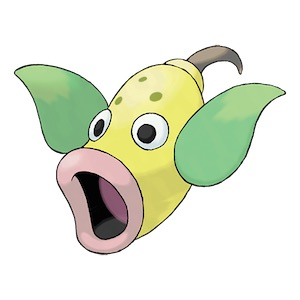

# pokemon-image-generator

Use a genetic algorithm to create an image using pokemon emojies.

| Target image | Result (CIEDE2000 fitness) |
| ----- | ----- |
|||

# Setup
* `conda env create`

# Usage
* `python generate_image.py `

